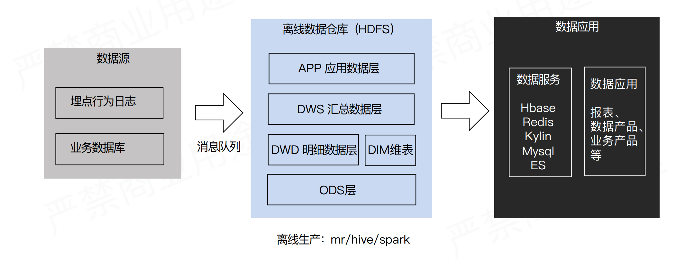
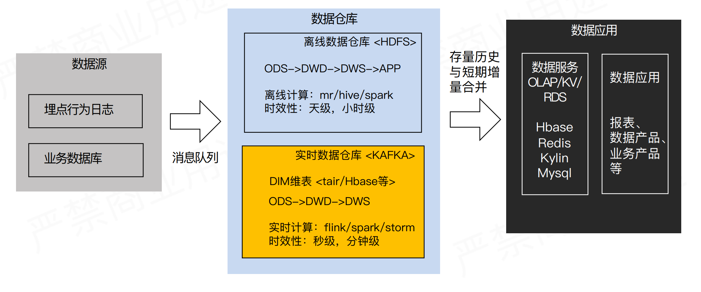
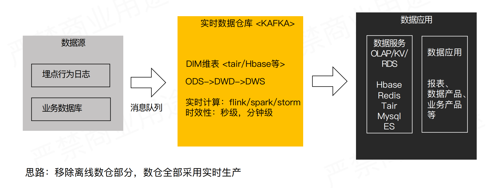
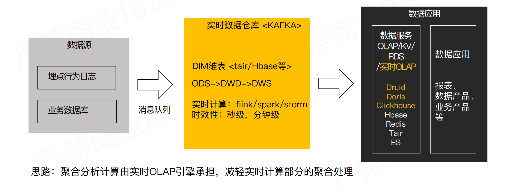
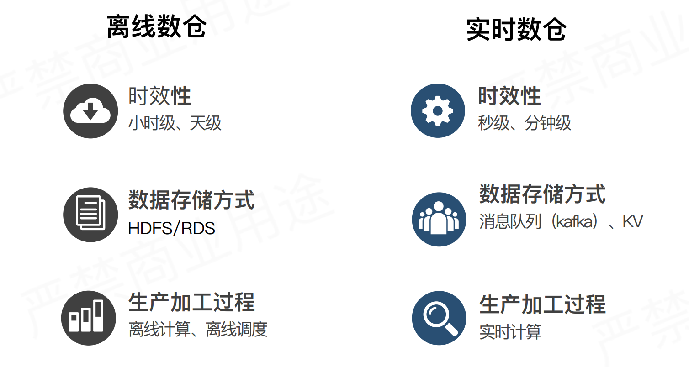

# 实时数仓概述

## 实时数仓产生背景

我们先来回顾一下数据仓库的概念。

**数据仓库：**

**数据仓库是一个面向主题的（Subject Oriented）、集成的（Integrate）、相对稳定的（Non-Volatile）、反映历史变化（Time Variant）的数据集合，用于支持管理决策。**

**建模方法：**

- 范式建模
- 维度建模

在互联网大数据场景下，用的最多的是维度建模方法。

然后先看一下离线数仓的经典架构。如下图：

这个数仓架构主要是偏向互联网大数据的场景方案，由上图可以看出有三个核心环节。

1. 第一个环节是**`数据源部分`**，一般互联网公司的数据源主要有两类：

   - 第 1 类是通过在客户端埋点上报，收集用户的`行为日志`，以及一些后端日志的日志类型数据源。对于埋点行为日志来说，一般会经过一个这样的流程，首先数据会上报到 Nginx 然后经过 Flume 收集，然后存储到 Kafka 这样的消息队列，然后再由实时或者离线的一些拉取的任务，拉取到我们的离线数据仓库 HDFS。

2. - 第 2 类数据源是`业务数据`库，而对于业务数据库的话，一般会经过 Canal 收集它的 binlog，然后也是收集到消息队列中，最终再由 Camus 拉取到 HDFS。

3. 这两部分数据源最终都会落地到 HDFS 中的 ODS 层，也叫贴源数据层，这层数据和原始数据源是保持一致的。

4. 第二个环节是**`离线数据仓库`**，是图中蓝色的框展示的部分。可以看到它是一个分层的结构，其中的模型设计是依据维度建模思路。

5. - 最底层是 ODS 层，这一层将数据保持无信息损失的存放在 HDFS，基本保持原始的日志数据不变。
   - 在 ODS 层之上，一般会进行统一的数据清洗、归一，就得到了 DWD 明细数据层。这一层也包含统一的维度数据。
   - 然后基于 DWD 明细数据层，我们会按照一些分析场景、分析实体等去组织我们的数据，组织成一些分主题的汇总数据层 DWS。
   - 在 DWS 之上，我们会面向应用场景去做一些更贴近应用的 APP 应用数据层，这些数据应该是高度汇总的，并且能够直接导入到我们的应用服务去使用。

6. 在中间的离线数据仓库的生产环节，一般都是采用一些离线生产的架构引擎，比如说 MapReduce、Hive、Spark 等等，数据一般是存在 HDFS 上。

7. 经过前两个环节后，我们的一些应用层的数据会存储到数据服务里，比如说 HBase 、Redis、Kylin 这样的一些 KV 的存储。并且会针对存在这些数据存储上的一些数据，封装对应的服务接口，对外提供服务。在最外层我们会去产出一些面向业务的报表、面向分析的数据产品，以及会支持线上的一些业务产品等等。这一层的话，称之为更贴近业务端的数据应用部分。

以上是一个基本的离线数仓经典架构的介绍。

大家都了解到现在随着移动设备的普及，我们逐渐由制造业时代过渡到了互联网时代。在制造业的时代，传统的数仓，主要是为了去支持以前的一些传统行业的企业的业务决策者、管理者，去做一些业务决策。那个时代的业务决策周期是比较长的，同时当时的数据量较小，Oracle、DB2 这一类数据库就已经足够存了。

但随着分布式计算技术的发展、智能化技术发展、以及整体算力的提升、互联网的发展等等因素，我们现在在互联网上收集的数据量，已经呈指数级的增长。并且业务不再只依赖人做决策，做决策的主体很大部分已转变为计算机算法，比如一些智能推荐场景等等。所以这个时候决策的周期，就由原来的天级要求提升到秒级，决策时间是非常短的。在场景上的话，也会面对更多的需要实时数据处理的场景，例如实时的个性化推荐、广告的场景、甚至一些传统企业已经开始实时监控加工的产品是否有质量问题，以及金融行业重度依赖的反作弊等等。因此在这样的一个背景下，实时数仓就必须被提出来了。

## 实时数仓架构

首先跟大家介绍一下实时数仓经典架构 - Lambda 架构：

###  Lambda 架构

这个架构是 Storm 的作者提出来的，其实 Lambda 架构的主要思路是在原来离线数仓架构的基础上叠加上实时数仓的部分，然后将离线的存量数据与我们 t+0 的实时的数据做一个 merge，就可以产生数据状态实时更新的结果。

- 和上述 1.1 离线数据仓库架构图比较可以明显的看到，实时数仓增加的部分是上图黄色的这块区域。我们一般会把实时数仓数据放在 Kafka 这样的消息队列上，也会有维度建模的一些分层，但是在汇总数据的部分，我们不会将 APP 层的一些数据放在实时数仓，而是更多的会移到数据服务侧去做一些计算。
- 然后在实时计算的部分，我们经常会使用 Flink、Spark-streaming 和 Storm 这样的计算引擎，时效性上，由原来的天级、小时级可以提升到秒级、分钟级。

大家也可以看到这个架构图中，中间数据仓库环节有两个部分，一个是离线的数据仓库，一个是实时的数据仓库。我们必须要运维两套（实时计算和离线计算）引擎，并且在代码层面，我们也需要去实现实时和离线的业务代码。然后在合并的时候，我们需要保证实时和离线的数据一致性，所以但凡我们的代码做变更，我们也需要去做大量的这种实时离线数据的对比和校验。其实这对于不管是资源还是运维成本来说都是比较高的。这是 Lamda 架构上比较明显和突出的一个问题。因此就产生了 Kappa 结构。

### Kappa 架构

Kappa 架构的一个主要的思路就是在数仓部分移除了离线数仓，数仓的生产全部采用实时数仓。从上图可以看到刚才中间的部分，离线数仓模块已经没有了。

关于 Kappa 架构，熟悉实时数仓生产的同学，可能会有一个疑问。因为我们经常会面临业务变更，所以很多业务逻辑是需要去迭代的。之前产出的一些数据，如果口径变更了，就需要重算，甚至重刷历史数据。对于实时数仓来说，怎么去解决数据重算问题？

Kappa 架构在这一块的思路是：首先要准备好一个能够存储历史数据的消息队列，比如 Kafka，并且这个消息对列是可以支持你从某个历史的节点重新开始消费的。接着需要新起一个任务，从原来比较早的一个时间节点去消费 Kafka 上的数据，然后当这个新的任务运行的进度已经能够和现在的正在跑的任务齐平的时候，你就可以把现在任务的下游切换到新的任务上面，旧的任务就可以停掉，并且原来产出的结果表也可以被删掉。

随着我们现在实时 OLAP 技术的一些提升，有一个新的实时架构被提了出来，这里暂且称为实时 OLAP 变体。

### 实时OLAP

这个思路是把大量的聚合、分析、计算由实时 OLAP 引擎来承担。在实时数仓计算的部分，我们不需要做的特别重，尤其是聚合相关的一些逻辑，然后这样就可以保障我们在数据应用层能灵活的面对各种业务分析的需求变更，整个架构更加灵活。

最后我们来整体对比一下，实时数仓的这几种架构：

这是整体三个关于实时数仓架构的一个对比：

- 从计算引擎角度：Lamda 架构它需要去维护批流两套计算引擎，Kappa 架构和实时 OLAP 变体只需要维护流计算引擎就好了。
- 开发成本：对 Lamda 架构来说，因为它需要维护实时离线两套代码，所以它的开发成本会高一些。Kappa 架构和实时 OLAP 变体只用维护一套代码就可以了。
- 分析灵活性：实时 OLAP 变体是相对最灵活的。
- 在实时 OLAP 引擎依赖上：实时 OLAP 变体是强依赖实时 OLAP 变体引擎的能力的，前两者则不强依赖。
- 计算资源：Lamda 架构需要批流两套计算资源，Kappa 架构只需要流计算资源，实时 OLAP 变体需要额外的 OLAP 资源。
- 逻辑变更重算：Lamda 架构是通过批处理来重算的，Kappa 架构需要按照前面介绍的方式去重新消费消息队列重算，实时 OLAP 变体也需要重新消费消息队列，并且这个数据还要重新导入到 OLAP 引擎里，去做计算。

## 传统数仓 vs 实时数仓

然后我们来看一下传统数仓和实时数仓整体的差异。

1. 首先从 **时效性** 来看：离线数仓是支持小时级和天级的，实时数仓到秒级分钟级，所以实时数仓时效性是非常高的。
2. 在 **数据存储方式** 来看：离线数仓它需要存在 HDFS 和 RDS 上面，实时数仓一般是存在消息队列，还有一些 kv 存储，像维度数据的话会更多的存在 kv 存储上。
3. 在 **生产加工过程** 方面，离线数仓需要依赖离线计算引擎以及离线的调度。但对于实时数仓来说，主要是依赖实时计算引擎。

# 实时数仓应用案例

这里选了几篇文章，介绍了实时数仓在各公司的应用

**数仓建模：**

[数仓|大数据时代,维度建模过时了吗?](https://mp.weixin.qq.com/s/CeVIYuCOoWwKr47xecd0IA)

该如何设计数仓的汇总层(DWS)](https://mp.weixin.qq.com/s/dVwcQST8StKO3Mc0jNe0ag)

**实时数仓：**

[实时数仓在滴滴的实践和落地](https://mp.weixin.qq.com/s/PdxjNQd7SNx1POv6fVKVmA)

[美团外卖实时数仓建设实践](https://mp.weixin.qq.com/s/JrpeTyznCH5jUABrFM8eVw)

[美团配送实时特征平台建设实践](https://mp.weixin.qq.com/s/gafduk7jhD9QnB1Lmmb1qw)

[基于 Flink + ClickHouse 打造轻量级点击流实时数仓](基于 Flink + ClickHouse 打造轻量级点击流实时数仓)

[菜鸟实时数仓技术架构演进](https://mp.weixin.qq.com/s/ugiDMCSnArlRaVkYV4yqLA)

